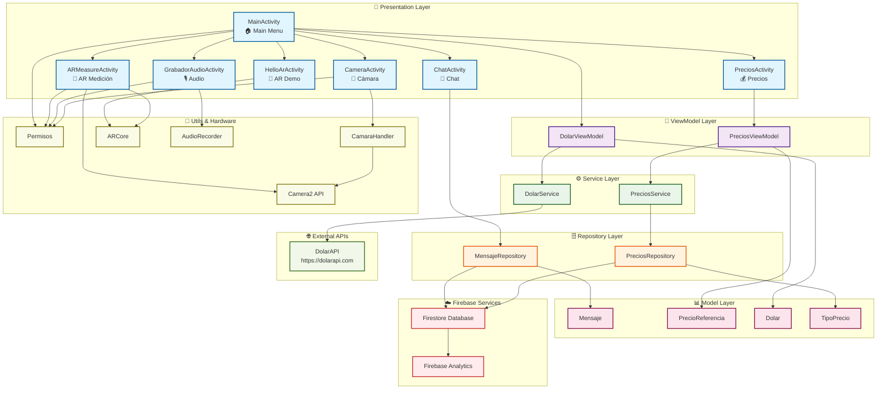
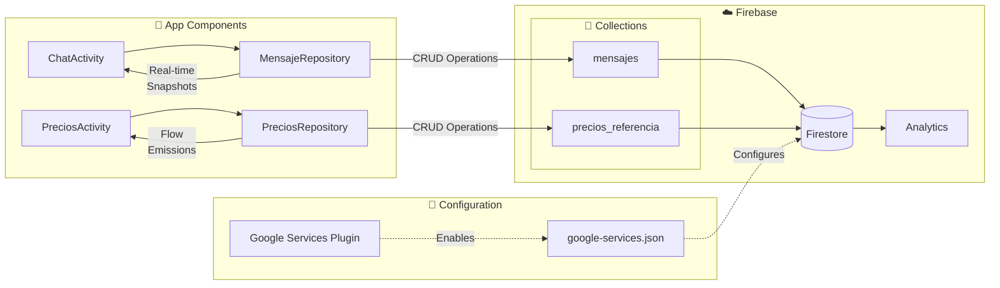
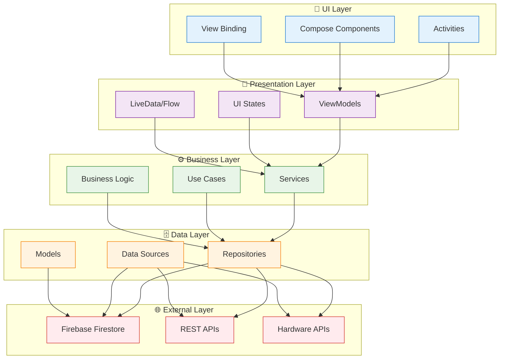

# Diagrama de Arquitectura - Aplicación LOAM TP1

## Arquitectura General de la Aplicación

## Detalle de Firebase Integration

## Arquitectura por Capas

## Tecnologías y Dependencias Clave

### 🔧 Core Technologies
- **Kotlin** - Lenguaje principal
- **Android SDK** - Plataforma base
- **Jetpack Compose** - UI moderna
- **View Binding** - Binding de vistas

### ☁️ Firebase Services
- **Firestore** - Base de datos NoSQL en tiempo real
- **Analytics** - Análisis de uso
- **Google Services** - Configuración y autenticación

### 📱 Android Jetpack
- **Lifecycle** - Gestión del ciclo de vida
- **ViewModel** - Arquitectura MVVM
- **LiveData/Flow** - Programación reactiva
- **Navigation** - Navegación entre pantallas
- **Camera** - API de cámara

### 🔮 AR/3D Features
- **ARCore** - Realidad aumentada
- **Camera2** - Control avanzado de cámara
- **OBJ Loader** - Carga de modelos 3D

### 🌐 Networking
- **Ktor** - Cliente HTTP para APIs REST
- **Gson** - Serialización JSON

### 📊 Data Flow
1. **UI Events** → ViewModels
2. **ViewModels** → Services/Repositories
3. **Repositories** → Firebase/APIs
4. **Data Changes** → Reactive Updates (Flow/LiveData)
5. **UI Updates** → Compose Recomposition

### 🔐 Permissions
- **CAMERA** - Acceso a cámara
- **RECORD_AUDIO** - Grabación de audio
- **INTERNET** - Conexión a APIs y Firebase
- **STORAGE** - Almacenamiento local
- **CALL_PHONE** - Llamadas telefónicas

Esta aplicación sigue una arquitectura limpia con separación clara de responsabilidades, implementando patrones modernos de Android como MVVM, programación reactiva con Flow/LiveData, y integración robusta con Firebase para funcionalidades en tiempo real.